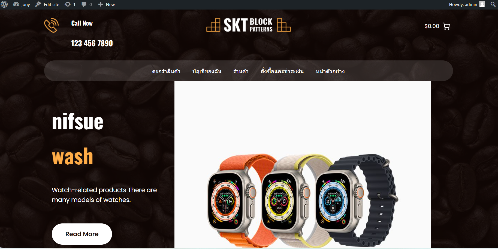

# Modern-Ecommerce-Platforms
Design and Develop Modern Ecommerce Plaffor
# Project Overview
Website design for selling good quality and genuine watches. Therefore, you can be confident that our watches are efficient watches. It is not a second-hand product or an authentic product, but a 100% genuine quality product which we bring from the genuine center. We choose to design a website that is easy to use for everyone. Customers can access to use the website in a simple and convenient manner. WordPress website design is a very popular website creation platform these days due to its ease of use and many add-ons for website development. The important thing that we chose to use WordPress for is that it is not difficult to create a website. It is safe. And there are constant updates.

# 1.Introduction
Nowadays, there is a type of shopping called online shopping that allows for the convenience of buying products where we do not have to leave the house or waste time traveling to shop. This is why entering the world of e-commerce is another good way.

# 2.Software and Tools Used
**2.1Laragon:** [Laragon](https://laragon.org/why-laragon/) is basically a web server emulator. It works quickly and efficiently for PHP, Node.js Python, java, Go, Ruby. It's fast and lightweight. Easy to use and easily expandable

**2.2Wordpress:** [WordPress](https://th.wordpress.org/) is an alternative or the easiest way to create a website. Wordpress is the most popular to use to create our own websites or blogs.

**2.3 WooCommerce:** [WooCommerce](https://woocommerce.com/) integrates perfectly with WordPress. Enhance our website using ecommerce capabilities. and manage products Product function

**2.4 PDF Invoices & Packing Slips for WooCommerce:**[PDF Invoices & Packing Slips for WooCommerce](https://wordpress.org/plugins/woocommerce-pdf-invoices-packing-slips/) Responsible for creating professional invoices and packing records for customer orders. This ensures a smooth and professional shopping experience.

**2.5 CartFlows:** [CartFlows](https://cartflows.com) It is a shopping cart used to enhance the efficiency of our website smoothly or quickly.

# Visual Paradigm
Visual Paradigm is a leading and globally recognized provider for Business and IT Transformation software solutions. It enables organizations to improve business and IT agility and foster innovation through popular open standards. Our award-winning products are trusted by over 320,000 users in companies ranging from small business, consultants, to blue chip organizations, universities and government units across the globe. About Visual Paradigm Visual Paradigm.

The first thing we download WordPress, we log in. After logging into WordPress, you will see the home page, which has nothing. Everything we have to create ourselves. When we want to download We went to download WordPress, the important thing is our website page. When creating our web page there are two options to choose from. The first way is to create it from scratch. The second way is to find someone else's theme and change it to your website. We will choose the theme of Coffee Block version 1.0 by SKT Themes. The website page that we choose will be a website about coffee beans and providing knowledge about coffee beans. His website was similar to our idea so we changed it to ours to make a website selling watches. After that, we can decorate our website however we want. We use them to create a more complete website, after which we choose the plugins we want to use. Plugins work to make your website more efficient than before.

# Wedsite Overview

# BPMN Diagram

This diagram of our BPMN shows the process of our e-commerce website. It presents important coordination or interactions and processes or procedures. About online trading It will make the launch of our online platform more experience or user friendly.

### All Pools in BPMN
- Customer
- Website
- Admin
- Delivery

  ## Customer pool
  
- customer process Starting with a green dot It marks the beginning of the customer journey on the platform.
- Find products: Customers will find products that they are interested in purchasing.
- Select Product: Customers select the products they want.
Add product to cart: After the customer has added the product to the cart. If the customer feels dissatisfied with the selected product. The customer can cancel or if the customer is interested or satisfied. will enter into payment
- Payment process: Payment of the product selected by the customer. There will be a payment process. The customer must fill in customer information, including the customer's address, phone number, and other things in order to deliver the product to the customer.
- Payment process or procedure: There will be 2 methods as two options. The first method is to transfer money via mobile phone called pay online. The second method of paying in cash is called cash on delivery. This way, we pay when our product arrives at our hands, which we do through thousands of couriers.
 ## Website pool
   
- Waiting to receive orders from children in order to check slips or check customer slips.
- Receive slip: Check slip and confirm your order. This process when checking money withdrawals The customer payment division is correct. It will go into stock inspection and if there are any errors it will be canceled immediately.
- Collect customer information: It is responsible for collecting customer information from every person who comes to use the service. When a customer has a problem, we will have information to inform that customer.
- Collect ordering information: serves to collect information from customers who have ordered products with us.
 ## Admin pool
  
- Confirm customer orders before arranging for delivery to the courier company.
- Customer information and customer slips will be checked for accuracy before taking the package to the courier company.
- Prepare to deliver customer products to the parcel delivery company.
 ## Delivery pool
   
- Will receive products to put the products of the sender into the system and update.
- The system has successfully verified the product in the system and a parcel number will be sent.
- The parcel will be delivered to the customer. At that time there will be an update on the customer's products.
- For customers who pay on delivery, they can wait to receive their products from thousands of parcel delivery staff.
 ## Delivery status
 - When our products leave the courier company, we must wait at least three days for the products to arrive. Whether we pay via mobile phone or pay on delivery, we must wait no more than three days.
## Summary
- Using an e-commerce website is one way to tap into the digital transformation of the online world. Easy to use for many people and user-friendly, WordPress and Woocommerce have a lot of accessibility when it comes to careful deployment and use of each plugin.
