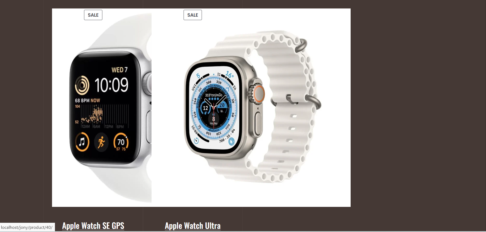
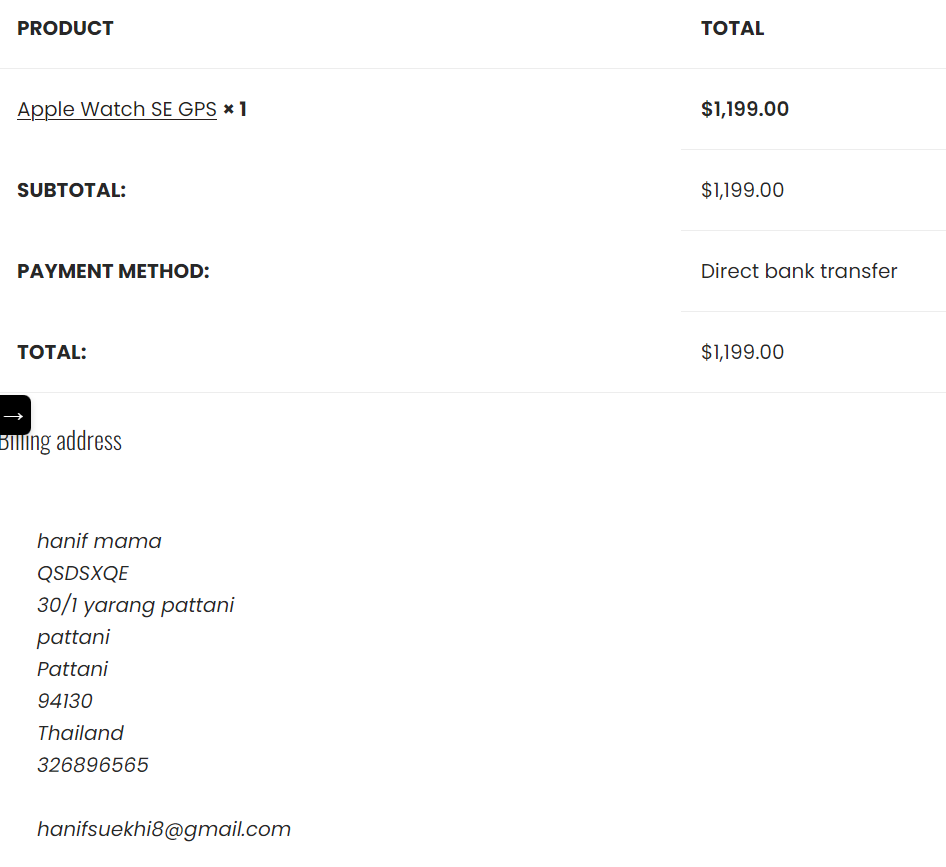

# Modern-Ecommerce-Platforms
Design and Develop Modern Ecommerce Plafform
### BPMN Diagram

This BPMN diagram shows our ecommerce website process. It outlines workflows to improve or modify the platform's customer-friendly online watch shop.

This project is about developing an e-commerce website for Watch, a watch shop. The website will be built using the WordPress content management system (CMS) and will include the WooCommerce plugin to facilitate easy ecommerce deployment. This platform allows Watch customers to browse and purchase watches online. and provide a convenient way to access the store.

### Add to Cart
The selected products are added to the customer's shopping cart.

## Check Out Process
The process to Checkout the product.
## Fill the shipping detail
The customer fill their shipping detail.

Payment: In my website, there are 2 methods of payment, namely bank transfer and destination.

